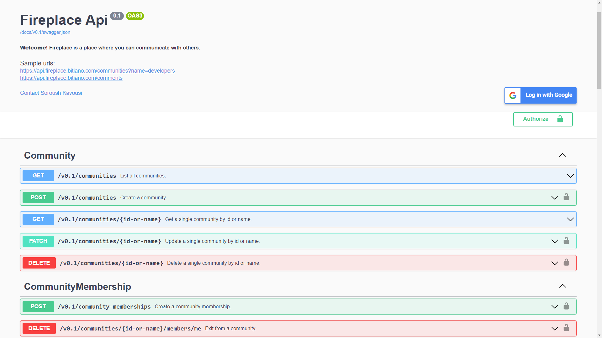
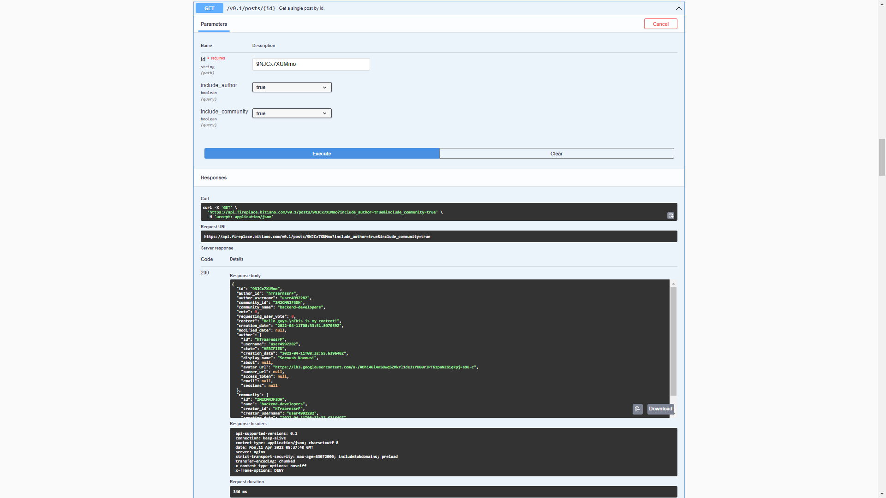
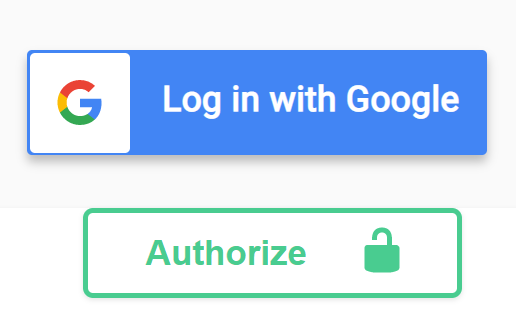
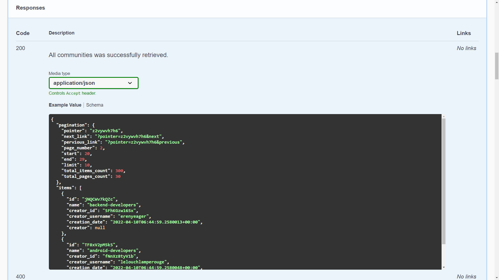
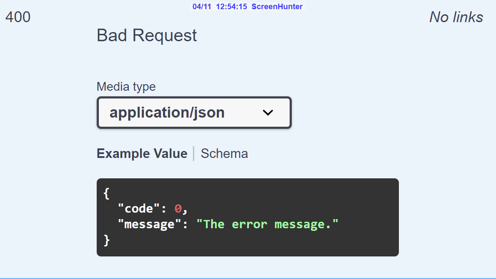
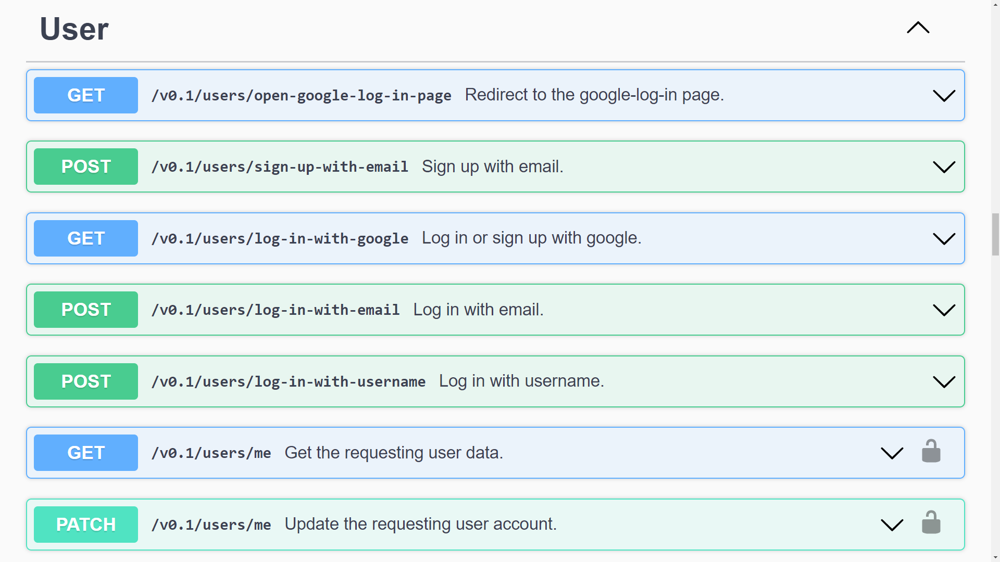

# Introduction

***Fireplace*** is a discussion application with communities, posts, and comments, just like Reddit.

This project, ***Fireplace API***, provides an API for Fireplace, and it aims to be a real-world example of web API concepts with the ***`ASP.NET Core`*** framework. As I needed to record the knowledge and experience I have learned in my coding history, I created this project for myself and everyone who considers it valuable.

 <br/>
 
# Highlights

1. [Architecture](#architecture)
2. [Swagger](#swagger)
3. Connected to a [PostgreSQL](https://www.postgresql.org/) database
4. Has advanced logging system with [NLog](https://nlog-project.org/)
5. Supports pagination
6. Supports nested comments
7. Supports user sessions
8. Supports error codes
9. [Id Generation and Encoding](#id-generation-and-encoding)
10. [Various sign up and log in methods](#various-sign-up-and-log-in-methods)
11. Hosted with [Docker](https://www.docker.com/)


 <br/> <br/> <br/>
 
# Architecture

<div align="center">
  
</div>

### Layers:

*According to Eric Evans's book [Domain Driven Design](https://domainlanguage.com/ddd/)*

> The DDD patterns help you understand the complexity of the domain.

- #### The Core Layer (Domain Model Layer)

	 - The heart of business software 
	 - Responsible for representing concepts of the business, information about the business situation, and business rules. 
	 -  Must completely ignore data persistence details.

- #### The API Layer (Application Layer)
	- Defines the jobs the software is supposed to do
	- It interacts with the application layers of other systems
	- It does not contain business rules or knowledge
	- Must not directly depend on any infrastructure framework.

- #### The Infrastructure Layer
	- Defines how the data is persisted in databases or other persistent storage
	- Responsible for connecting to external systems and services
	- It does not contain business rules or knowledge

 <br/> <br/>

# Swagger

With the ***swagger UI***, you can easily interact with the API and learn it. It shows all routes, inputs, outputs, models, and errors. It also generates a _[swagger.json](https://api.fireplace.bitiano.com/docs/v0.1/swagger.json)_ which describes the schema of the API that can be imported into your app.

[Check the **Swagger UI** website now](https://api.fireplace.bitiano.com/docs/index.html)

 <br/>
 
<div align="center">
  
</div>

 <br/>
 
<div align="center">
  
  <p><i>a sample of an execution</i></p>
</div>

 <br/>  <br/>
 
 
### *Special Features*:

1. #### Log in With google

I did customize the swagger UI to have a `log-in-with-google` button. 


<div align="center">
  
</div>

 <br/>
 
 This was possible by ***injecting a CSS file*** to Swagger UI:
```csharp
app.UseSwaggerUI(options =>
{
	options.InjectStylesheet("/swagger-ui/custom-swagger-ui.css");
});
```
[See the **custom-swagger-ui.css** file](Api/wwwroot/swagger-ui/custom-swagger-ui.css)

and the HTML which is added to the ***swagger description*** section:

```csharp
description_html += $@"
 <a id=""google-btn"" target=""_blank"" href=""{GlobalOperator.GlobalValues.Api.BaseUrlPath}/v0.1/users/open-google-log-in-page"">
     <div id=""google-icon-wrapper"">
         
     </div>
     <p id=""btn-text""><b>Log in with Google</b></p>
 </a>
 ";
```

 <br/> <br/>
  
2. #### Full examples of possible responses

 <br/>
 
<div align="center">
  
</div>

 <br/>
 
<div align="center">
  
</div>

 <br/> <br/>
 

# Id Generation and Encoding

How to generate and encode an id into a fixed 11-length string of characters:

 <br/> 
 
- ***Example:***

|Id| Encoded Id  |
|--|--|
| 1034467521726252594 | 9NJCx7XUMmo |


  <br/>   <br/>

1.  **Generate a random unsigned long number**
	- between min and max

```csharp
ulong _min = (ulong)Math.Pow(2, 10);
ulong _max = ulong.MaxValue - 1;
var id = Utils.GenerateRandomUlongNumber(_min, _max);
```
 <br/>

The `GenerateRandomUlongNumber` method:
```csharp
private static readonly Random _random = new Random();

public static ulong GenerateRandomUlongNumber(ulong min, ulong max)
{
    ulong uRange = (max - min);
    ulong ulongRand;
    do
    {
        byte[] buf = new byte[8];
        _random.NextBytes(buf);
        ulongRand = BitConverter.ToUInt64(buf, 0);
    } while (ulongRand > ulong.MaxValue - ((ulong.MaxValue % uRange) + 1) % uRange);

    return (ulongRand % uRange) + min;
}
```
 <br/>

2.  **Get bytes of the number**
```csharp
var bytes = BitConverter.GetBytes(id);
```

 <br/>

3. **Encode the bytes with a base58 mapper**

```csharp
var encodedId = Base58.Bitcoin.Encode(bytes);
```

- Why `Base58`? 

Just like a bitcoin address:
<div align="center">
  
</div>
Note: the non-alphanumeric characters in base-64 is "+" and "/"

 <br/> <br/>
 
4. **I also added some filters**

```csharp
// To filter 10-length encoded ids
if (id % 256 < 6)
	return false;

// To filter encoded ids which has three same characters in a row
Regex _encodedIdWrongRepetitionRegex = new(@"(\S)\1{2}");
if (_encodedIdWrongRepetitionRegex.IsMatch(encodedId))
	return false;
```
 <br/>

[Check the **IdGenerator** class](Core/Tools/IdGenerator.cs)

 <br/> <br/>

# Various sign up and log in methods


### Current State:

- #### Sign up 
	- Google OAuth 2.0 (server-side)
	- Email
- #### Log in
	- Google OAuth 2.0 (server-side)
	- Email
	- Username

<br/>

### Access Token:

Scheme: ***Bearer***

The access token can be placed at ***cookies*** or ***headers***.

<br/>

### Routes:

<br/>
  
<div align="center">
  
</div>

<br/><br/>

If you are interested in the Google OAuth 2.0 implementation, you can check these links:

[Check the **GoogleGateway** class](Infrastructure/Gateways/GoogleGateway.cs)

[Check the **LogInWithGoogleInputQueryParameters** class](Api/Controllers/Parameters/UserParameters/LogInWithGoogleParameters.cs)

[Check the **LogInWithGoogleAsync** method in **UserOperator** Class](Core/Operators/UserOperator.cs#L91)

<br/>